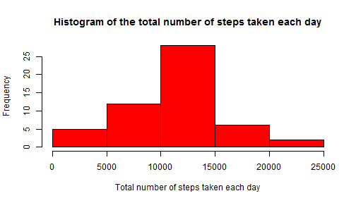
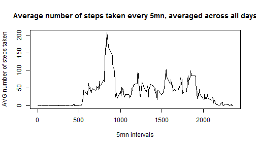
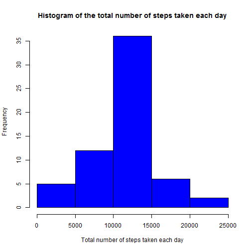
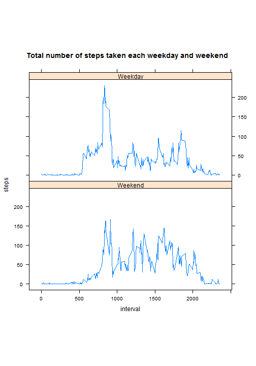

###NOTE:  
####For this project, we use the "dplyr" and "lattice" libraries.   

<br/>
<br/>


###Loading and preprocessing the data  

####1. Read Data into data frame df  

```r
df<-read.csv("activity.csv")
head(df)
```

```
##   steps       date interval
## 1    NA 2012-10-01        0
## 2    NA 2012-10-01        5
## 3    NA 2012-10-01       10
## 4    NA 2012-10-01       15
## 5    NA 2012-10-01       20
## 6    NA 2012-10-01       25
```

  
  
  
####2. Process/transform the data
Nope.

<br/>
<br/>

###What is mean total number of steps taken per day?  
I remove the missing values in the dataset.  

```r
dfNONA<-na.omit(df)
head(dfNONA)
```

```
##     steps       date interval
## 289     0 2012-10-02        0
## 290     0 2012-10-02        5
## 291     0 2012-10-02       10
## 292     0 2012-10-02       15
## 293     0 2012-10-02       20
## 294     0 2012-10-02       25
```

<br/>

####1. Calculate the total number of steps taken per day  
I have already removed the NA values above in dfNONA data frame. This is this data frame I am using below.

```r
## here we exclude the interval col
##aggregate(dfNONA[, 1], list(dfNONA$date), sum)
df_StepsPerDay<-dfNONA %>% select(date,steps) %>% group_by(date) %>% summarise_each(funs(sum))
##df_StepsPerDay
```

<br/>

####2. Make a histogram of the total number of steps taken each day  

```r
hist(as.data.frame(df_StepsPerDay)[,2], main="Histogram of the total number of steps taken each day", 
     xlab="Total number of steps taken each day", ylab="Frequency", col="red")
```

 

<br/>

####3. Calculate and report the mean and median of the total number of steps taken per day  
Mean of the total number of steps taken per day is:

```r
s<-summary(as.data.frame(df_StepsPerDay)[,2])
mean_sum<-sprintf("%1.2f",as.numeric(s["Mean"]))
mean(as.data.frame(df_StepsPerDay)[,2])
```

```
## [1] 10766.19
```
Median of the total number of steps taken per day is:

```r
median_sum<-sprintf("%1.2f",as.numeric(s["Median"]))
median(as.data.frame(df_StepsPerDay)[,2])
```

```
## [1] 10765
```
  
  Note: there are some differences between the mean and median calculated in the "summarize" function and mean and median funtions.
  Indeed, mean through summarize is: 10770.00 and median is 10760.00.

<br/>
<br/>

###What is the average daily activity pattern?  
####1. Time series plot of the 5-minute interval and the average number of steps taken, averaged across all days    

```r
df_AvgStepsPerInterval5<-dfNONA %>% select(interval,steps) %>% group_by(interval) %>% summarise_each(funs(mean))
names(df_AvgStepsPerInterval5)<-c("Interval", "Avg_Steps")
plot( Avg_Steps~Interval,df_AvgStepsPerInterval5, xact="n", type="l",ylab="AVG number of steps taken", xlab="5mn intervals", main="Average number of steps taken every 5mn, averaged across all days")
```

 

<br/>

####2. Which 5-minute interval, on average across all the days in the dataset, contains the maximum number of steps?  

```r
Max_number<-filter(df_AvgStepsPerInterval5, Avg_Steps == max(df_AvgStepsPerInterval5$Avg_Steps))
##Max_number<-df_AvgStepsPerInterval5[which.max(df_AvgStepsPerInterval5$Avg_Steps),]$Interval
```

####The 5-minute interval that contains the max average number of steps across all days in the dataset is:  **835**

<br/>
<br/>

###Imputing missing values

```r
missing_values<-sum(is.na(df))
```
####1. The total number of missing values in the dataset is **2304** rows  

<br/>

####2. Devise a strategy for filling in all of the missing values in the dataset.
The strategy I choose for filing in all of the missing values is using the mean for that 5-minute interval.   
For this, I need to retrieve the mean steps in the dataset for each 5-mn interval from a function below coded. Then when there is a NA step for a perticular interval, I get the mean of the steps for this interval with this function.

```r
getMeanStepsToNA<-function()
{
  df_Filled<-df
  ##parsing all NA rows in steps from original dataset
  for (i in 1:nrow(df)) 
  {
    if(is.na(df[i,]$steps))
    {
      df_Filled[i,]$steps <- df_AvgStepsPerInterval5[df_AvgStepsPerInterval5$Interval==df[i,]$interval, ]$Avg_Steps
    }
  }
  df_Filled
}
```


<br/>

####3. Create a new dataset that is equal to the original dataset but with the missing data filled in
I use the function below: **getMeanStepsFrom** for each interval where avg step is NA

```r
dimdf<-dim(df)
df_Filled<-getMeanStepsToNA()
dimdfFilled<-dim(df_Filled)
```

**Some verifications**:  
1. we have 17568 rows and 3 columns in the original dataset and 17568 rows and 3 columns in the filled dataset. Same dimensions for both datasets.  
2. Here are means and median for each data frame:

```r
summ_df<-summary(df)
summ_dfFilled<-summary(df_Filled)
##library(xtable)
##xt_df<-xtable(summary(df))
##xt_dfFilled<-xtable(summ_dfFilled)
##print(xt_df,type="html")
##print(xt_dfFilled,type="html")
```
Summarize of df Original dataset :  
Mean: Median :  0.00    
Median: Mean   : 37.38    

Summarize of Filled Dataset (the one where we filled with mean for each interval with missing value):  
Mean: Median :  0.00    
Median: Mean   : 37.38    

**CONCLUSION: Datasets are equal.**  

<br/>

####4. Make a histogram of the total number of steps taken each day and Calculate 

```r
##totalStepsPerDay <- aggregate(steps ~ date, data = activityFilled, sum)
df_totalStepsPerDay<-df_Filled %>% select(date,steps) %>% group_by(date) %>% summarise_each(funs(sum))

hist(df_totalStepsPerDay$steps, main="Histogram of the total number of steps taken each day", 
     xlab="Total number of steps taken each day", ylab="Frequency", col="blue")
```

 


####Report the mean and median total number of steps taken per day.

```r
mean_totalStepsPerDay<-sprintf("%1.2f", round(mean(df_totalStepsPerDay$steps),2))
median_totalStepsPerDay<-sprintf("%1.2f", round(median(df_totalStepsPerDay$steps),2))
```

The mean total number of steps taken per day is **10766.19**  
The median total number of steps taken per day is **10766.19**

####Do these values differ from the estimates from the first part of the assignment?
It looks like we have the same datasets !!
The mean value is identical for both of the datasets because we put the mean of each particular 5mn interval in place of the missing value on a same 5mn interval.   

####What is the impact of imputing missing data on the estimates of the total daily number of steps?
The median values are a little bit different but it does not mean the datasets are not equal, it just means we have moved the median into the second dataset by introducing new values.

<br/>
<br/>

###Are there differences in activity patterns between weekdays and weekends?

####1. Create a new factor variable in the dataset with two levels - "weekday" and "weekend" indicating whether a given date is a weekday or weekend day.


```r
##create a vector of POSIXlt dates
VectorPOSIX<-as.POSIXlt(as.Date(df_Filled$date))
## determine which is a weekday or weekend (6: saturday is weekend, 0: sunday is weekend)
df_Filled$DayFactor = ifelse(VectorPOSIX$wday == 0, "Weekend", 
                            ifelse(VectorPOSIX$wday == 6, "Weekend", "Weekday"))
## make them factors
df_Filled$DayFactor = factor(df_Filled$DayFactor, levels=c("Weekend", "Weekday"))
```

<br/>

####2. Make a panel plot containing a time series plot (i.e. type = "l") of the 5-minute interval (x-axis) and the average number of steps taken, averaged across all weekday days or weekend days (y-axis). 

```r
library(lattice)
df_totalStepsDayFactor<-df_Filled %>% select(interval,steps,DayFactor) %>% group_by(DayFactor, interval) %>% summarise_each(funs(mean))

xyplot(steps ~ interval | DayFactor, data = df_totalStepsDayFactor, aspect = 1/2, type = "l", 
        main="Total number of steps taken each weekday and weekend")
```

 
